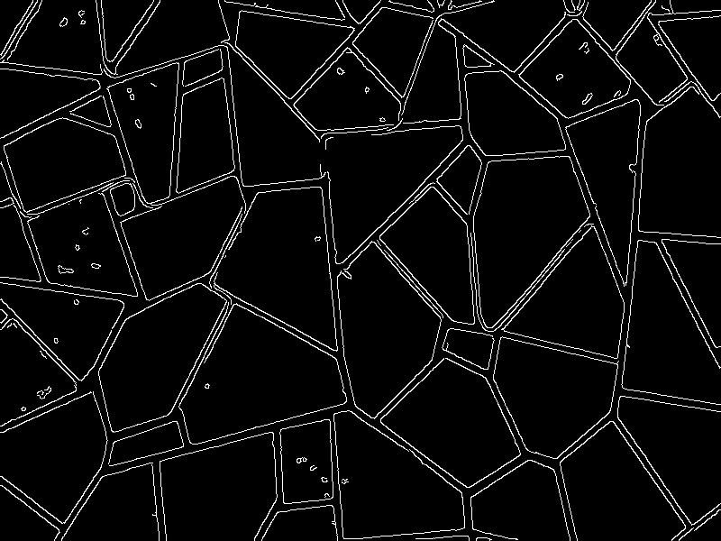
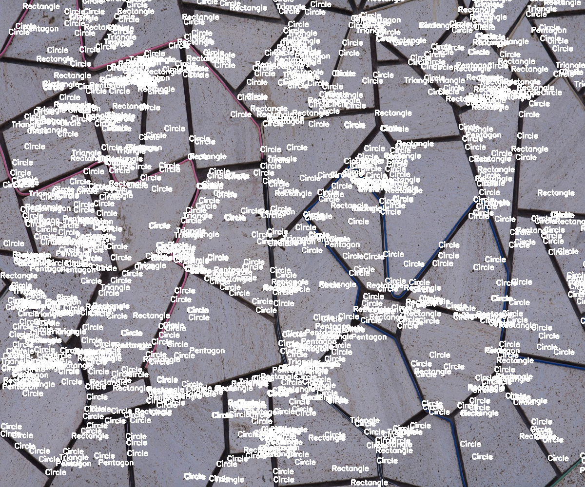
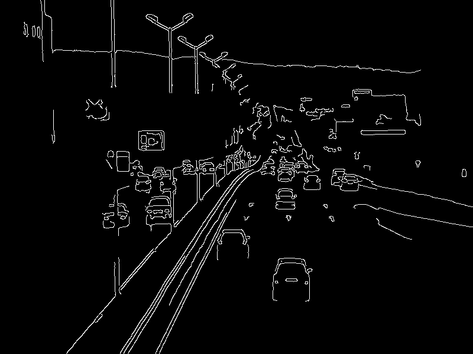

# Recognizing-shapes-in-Images-with-open-CV
"Shape Recognition in Images with OpenCV" is an innovative project, that focuses on utilizing the powerful OpenCV library to detect and identify various shapes present in images. This project showcases a collection of efficient algorithms and methods for accurate shape recognition
 
 

